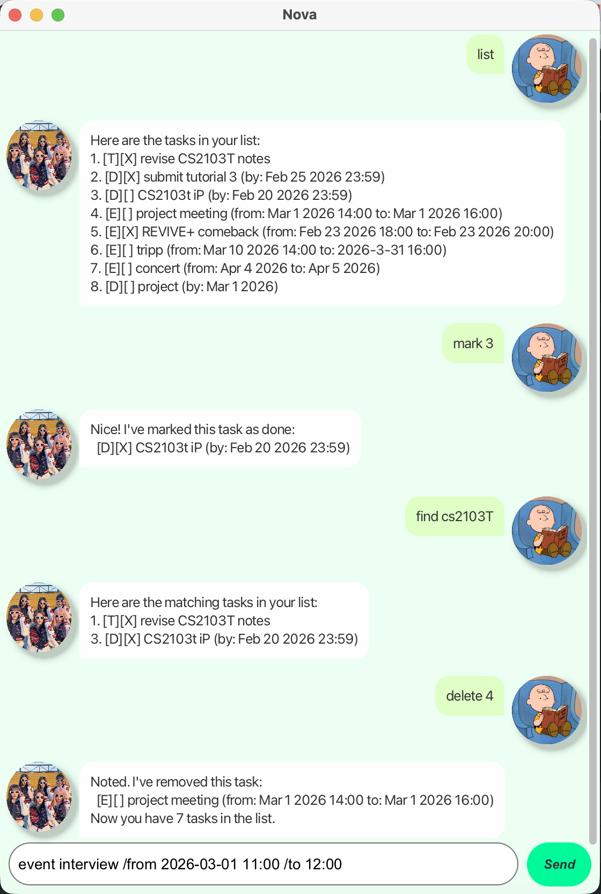

# Nova User Guide

<div style="text-align: center;">
  
</div>

SuSuSuSUPERNOVA Nova is a **simple, fast, and elegant task management chatbot** that helps you keep track of your todos, deadlines, and events. Interact with Nova through a clean GUI or CLI interface to manage your tasks efficiently.

Nova is:
- ~~FAST~~ **_SUPER FAST_** to use
- **Easy to use**: Simple command-based interface
- **Smart**: Case-insensitive search and duplicate detection
- **Reliable**: Automatic saving to ensure your tasks are never lost

---

## Quick Start

1. Ensure you have Java 11 or above installed on your computer
2. Download the latest `nova.jar` from the releases page
3. Double-click the jar file to launch the GUI, or run `java -jar nova.jar` in terminal for CLI mode
4. Type commands in the text box and press Enter or click Send
5. Your tasks are automatically saved to `data/nova.txt`

---

## Features

### Viewing all tasks: `list`

Shows all tasks in your task list.

**Format:** `list`

**Example:**
```
list
```

**Expected output:**
```
Here are the tasks in your list:
1. [T][ ] read book
2. [D][ ] submit assignment (by: Feb 28 2026)
3. [E][X] team meeting (from: Feb 20 2026 to: Feb 20 2026)
```

---

### Adding a todo: `todo`

Adds a simple task without any date or time.

**Format:** `todo DESCRIPTION`

**Example:**
```
todo read book
```

**Expected output:**
```
Got it. I've added this task:
  [T][ ] read book
Now you have 1 tasks in the list.
```

**Note:** Nova prevents duplicate tasks - you can't add the same task twice!

- For `ToDo` tasks, a duplicate means having the same **description**.
- For `Deadline` tasks, a duplicate means having the same **description** and **due date**.
- For `Event` tasks, a duplicate means having the same **description**, **start time**, and **end time**.

---

### Adding a deadline: `deadline`

Adds a task with a deadline.

**Format:** `deadline DESCRIPTION /by DATE_OR_TIME`

**Date formats supported:**
- `yyyy-MM-dd` (e.g., 2026-02-28)
- `yyyy-MM-dd HH:mm` (e.g., 2026-02-28 23:59)
- Natural language (e.g., tomorrow, Friday)

**Example:**
```
deadline submit assignment /by 2026-02-28
```

**Expected output:**
```
Got it. I've added this task:
  [D][ ] submit assignment (by: Feb 28 2026)
Now you have 2 tasks in the list.
```

---

### Adding an event: `event`

Adds a task that happens over a period of time.

**Format:** `event DESCRIPTION /from START /to END`

**Example:**
```
event team meeting /from 2026-02-20 /to 2026-02-20
```

**Expected output:**
```
Got it. I've added this task:
  [E][ ] team meeting (from: Feb 20 2026 to: Feb 20 2026)
Now you have 3 tasks in the list.
```

---

### Marking a task as done: `mark`

Marks a task as completed.

**Format:** `mark INDEX`

**Example:**
```
mark 2
```

**Expected output:**
```
Nice! I've marked this task as done:
  [D][X] submit assignment (by: Feb 28 2026)
```

**Note:** The index refers to the task number shown in the `list` command.

---

### Marking a task as not done: `unmark`

Unmarks a completed task.

**Format:** `unmark INDEX`

**Example:**
```
unmark 2
```

**Expected output:**
```
OK, I've marked this task as not done yet:
  [D][ ] submit assignment (by: Feb 28 2026)
```

---

### Finding tasks: `find`

Searches for tasks containing the specified keyword. **Case-insensitive!**

**Format:** `find KEYWORD`

**Example:**
```
find book
```

**Expected output:**
```
Here are the matching tasks in your list:
1. [T][ ] read book
3. [T][ ] return book to library
```

**Note:** Searching for "BOOK", "book", or "Book" will all return the same results!

---

### Deleting a task: `delete`

Removes a task from your list permanently.

**Format:** `delete INDEX`

**Example:**
```
delete 3
```

**Expected output:**
```
Noted. I've removed this task:
  [E][X] team meeting (from: Feb 20 2026 to: Feb 20 2026)
Now you have 2 tasks in the list.
```

---

### Exiting the program: `bye`

Closes the Nova application.

**Format:** `bye`

**Example:**
```
bye
```

**Expected output:**
```
Bye. Hope to see you again soon!
```

---

## Command Summary

| Command | Format | Example |
|---------|--------|---------|
| **List** | `list` | `list` |
| **Todo** | `todo DESCRIPTION` | `todo read book` |
| **Deadline** | `deadline DESCRIPTION /by DATE` | `deadline submit report /by 2026-03-01` |
| **Event** | `event DESCRIPTION /from START /to END` | `event conference /from 2026-03-10 /to 2026-03-12` |
| **Mark** | `mark INDEX` | `mark 2` |
| **Unmark** | `unmark INDEX` | `unmark 2` |
| **Find** | `find KEYWORD` | `find meeting` |
| **Delete** | `delete INDEX` | `delete 3` |
| **Exit** | `bye` | `bye` |


**Happy task managing with Nova!** 
